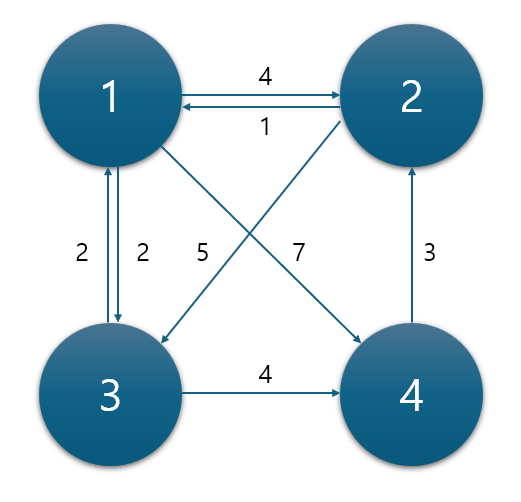

# 다익스트라 알고리즘

<li>최소 경로를 찾기
<li>우선순위 큐를 이용해 구현한 다익스트라 알고리즘

## 1. start와 end 설정한다
<b>`dist` 배열을 모두 INF로 초기화한다.</b>

<q>
    알고리즘 일련의 과정을 거치고 나면...
    <b>start에서 출발해</b> 다른 점으로 가는 모든 거리에 대한 답을 구할 수 있다!
</q>

## 2. 인접 정보를 담는 자료 구조를 만든다.
이 해답에서는 `vector<vector<pair<int,int>>>`를 이용해 필요한 정보만 딱! 담는 자료 구조를 만들었다.

예를 들어, T[1]에는 1 노드의 인접 정보인 {2,4}, {3,2}, {4,7}이 담겨 있다.

## 3. pq에 출발 지점에서의 인접 노드를 삽입한다.
이때 거리가 가까운 순으로 정렬된다.

인접 노드를 삽입하면서 dist를 업데이트한다.

<b><i>즉, 이 노드를 거쳐 갈 시에 dist가 더 최소인가?</b></i>

## 4. pq가 빌 때까지 계속해서 top의 노드에 대해 3을 수행한다.
반복문을 통해 수행한다.

# Reference
https://charles098.tistory.com/11